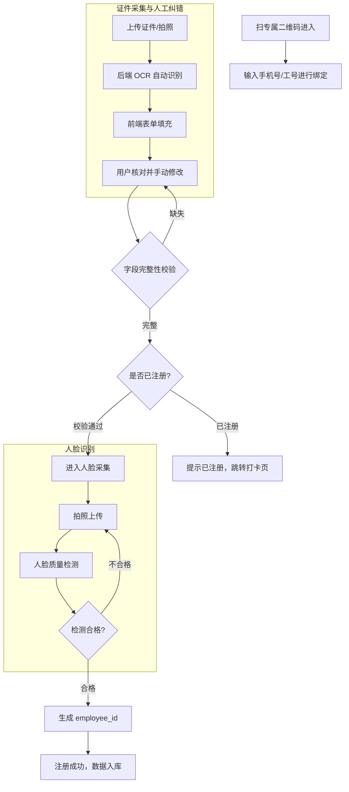
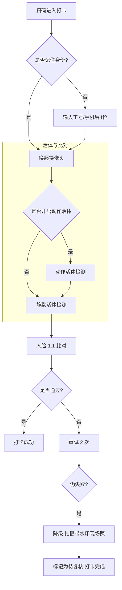

# 考勤打卡微应用系统设计方案 (Time & Attendance Micro-App)

## 1. 业务背景与核心诉求

### 1.1 客户诉求
- **目标群体**：小微企业（约 100 名员工）。
- **核心痛点**：需要一个轻量级的考勤工具，记录员工上下班信息，方便 HR/老板查看考勤状态。
- **实施顾虑**：客户对我方（SaaS 服务商）的实例稳定性和隐私合规存在一定顾虑，希望系统足够轻量、容错率高。

### 1.2 我方（服务商）诉求
- **核心目标**：构建“数据飞轮”。通过免费提供考勤工具，持续收集真实的、带 Ground Truth（用户人工修正过）的人脸和证件数据。
- **商业目标**：利用这些高质量的脱敏数据，反哺并优化我们底层的活体检测、人脸比对和 OCR 算法模型。
- **架构要求**：作为现有 SaaS 控制台的一个“第一方应用”接入，复用现有的多租户（Organization）和计费统计架构，避免重复造轮子。

---

## 2. 核心架构设计理念

### 2.1 租户完全隔离 (Multi-Tenancy)
- 员工（Employee）不属于系统全局用户（User），而是从属于特定的租户（Organization）。
- 员工不需要注册 SaaS 账号，不需要密码登录。打卡入口为一个带有 `org_id` 签名的专属 H5 链接/二维码。

### 2.2 降级优于阻断 (Degradation over Blocking)
考勤是高频且时间敏感的业务（早高峰）。
- **识别降级**：当 1:N 人脸检索失败，或活体检测超时时，不应阻断打卡。应允许员工拍摄带有时间水印的现场照片“异常打卡”，交由 HR 后台人工复核。
- **定位降级**：放弃强制 GPS 定位防作弊（避免合规风险和技术漂移）。依靠“活体+人脸”作为核心信任锚点。

### 2.3 “Human-in-the-loop” 数据采集
- OCR 识别结果仅作为表单的“初始填充值”。
- 系统必须记录 OCR 的**原始输出**与员工**最终提交的修改值**，这两者的 Diff 是算法团队最需要的 Hard Case 数据。

### 2.4 员工信息主权与隐私查看
虽然员工是匿名的（无 SaaS 账号），但必须提供一个机制让员工查看自己的注册信息和打卡记录。
- **方案**：在打卡成功后的结果页，提供一个「我的考勤」入口。
- **机制**：员工在前端输入手机号获取 OTP 验证码，验证通过后，前端获得一个临时的 `Employee-Session-Token`，允许其查询属于自己的 `org_employees` 信息和 `attendance_records`。

---

## 3. 业务流程设计

### 3.1 员工入职注册流程


### 3.2 半匿名打卡流程 (1:1 优先)


---

## 4. 数据库与存储设计

为了与现有系统解耦，新增以下三张核心业务表：

### 4.1 组织员工表 (`org_employees`)
员工的生命周期与 SaaS 租户强绑定。
```sql
CREATE TABLE org_employees (
    id VARCHAR(64) PRIMARY KEY,
    org_id VARCHAR(64) NOT NULL,          -- 关联 Organization
    employee_sn VARCHAR(64),              -- 客户内部工号
    id_number VARCHAR(64) NOT NULL,       -- 核心锚点 (证件号)
    name VARCHAR(64) NOT NULL,
    phone VARCHAR(20),
    face_feature BLOB,                    -- 提取出的人脸特征向量 (用于 1:1 比对)
    face_image_url VARCHAR(255),          -- 原始人脸图 (用于 HR 查看)
    status VARCHAR(20) DEFAULT 'active',  -- active, inactive, deleted
    created_at DATETIME,
    UNIQUE KEY idx_org_id_number (org_id, id_number)
);
```

### 4.2 考勤记录表 (`attendance_records`)
用于 HR 后台展示和统计。
```sql
CREATE TABLE attendance_records (
    id VARCHAR(64) PRIMARY KEY,
    org_id VARCHAR(64) NOT NULL,
    employee_id VARCHAR(64) NOT NULL,
    punch_time DATETIME NOT NULL,
    punch_type VARCHAR(10),               -- 'in' (上班), 'out' (下班)
    liveness_score FLOAT,                 -- 活体分数留存
    face_score FLOAT,                     -- 1:1 比对分数留存
    status VARCHAR(20),                   -- 'success', 'manual_review' (降级需复核)
    fallback_image_url VARCHAR(255),      -- 失败时的降级现场图
    created_at DATETIME,
    INDEX idx_org_time (org_id, punch_time)
);
```

### 4.3 算法数据反哺表 (`data_collection_documents`)
核心资产表，专供算法团队“白嫖”高质量数据。
```sql
CREATE TABLE data_collection_documents (
    doc_id VARCHAR(64) PRIMARY KEY,
    org_id VARCHAR(64) NOT NULL,
    id_type VARCHAR(20),                  -- 'passport', 'thai_id', 等
    raw_image_url VARCHAR(255),           -- 证件原图 (受访问策略严格保护)
    raw_ocr_result JSONB,                 -- 模型原始输出 (包含各字段置信度)
    final_user_input JSONB,               -- 用户修改后的 Ground Truth
    is_corrected BOOLEAN,                 -- 是否被用户修改过 (算法团队筛选 Hard Cases 的关键标识)
    created_at DATETIME
);
```

---

## 5. 计费与系统兼容性设计

该微应用不会破坏现有的 API Key 和计费逻辑，而是采用 **BFF (Backend for Frontend)** 模式接入：

1. **BFF 路由**：新建 `/api/v1/attendance/*` 路由组。
2. **内部调用**：前端请求该路由时，BFF 层在内部构建 `KYCRequest`，并调用底层的 `service.Liveness()` 和 `service.FaceCompare()`。
3. **无缝计费**：在 BFF 层注入该租户特定的 `Internal_App_Key`。底层服务像对待普通 API 请求一样，正常记录 `UsageLog` 并扣减 Quota。
4. **流控保护**：在 BFF 层实施严格的 IP 和 Org 级别的 Rate Limiting，防止早高峰压垮底层 GPU 推理服务。

---

## 6. 数据分析与管理者视角 (Analytics & Admin View)

为了满足客户“方便查看考勤状态”的核心诉求，系统需为租户管理员（HR/老板）提供管理视图：
1. **打卡限制策略**：允许管理员配置打卡规则（如：是否允许迟到打卡？是否开启距离提醒？）。
2. **异常处理中心**：管理员可在此处理 `status = manual_review`（因识别失败而降级提交的照片）的记录，进行人工通过或驳回。
3. **考勤报表**：提供周报/月报的聚合视图，通过 `punch_type` (in/out) 自动计算工时，满足最基本的薪资核算需求。

---

## 7. 合规与安全 (Compliance & Security)

1. **隐私政策挂载**：在员工首次扫码注册时，必须勾选包含数据脱敏与算法优化条款的《员工隐私授权协议》。
2. **数据脱敏**：提供给算法团队的 `data_collection_documents` 数据，应在导出时执行脚本，抹除姓名等直接关联 PII 的字段，仅保留图像特征和文本排版特征。
3. **离职清理**：当 HR 在控制台将员工标记为 `deleted` 时，必须同步清理其 `face_feature` 和相关证件原图，满足 GDPR/PDPA 的被遗忘权。