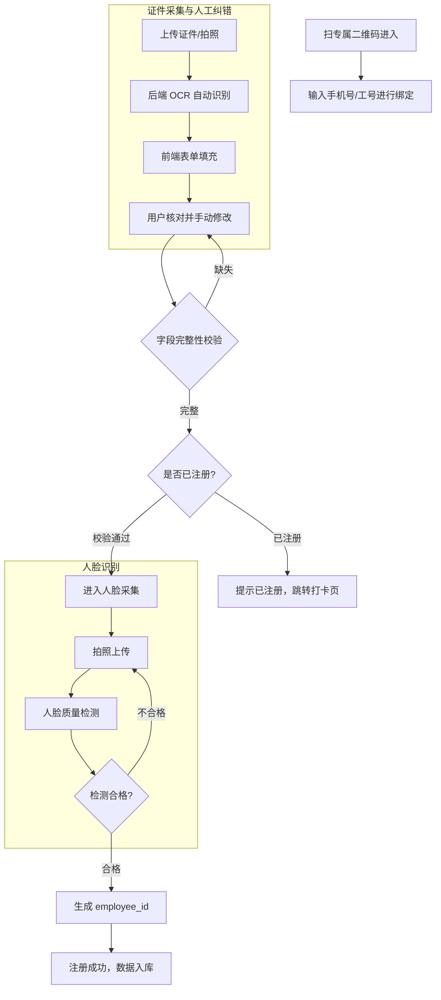
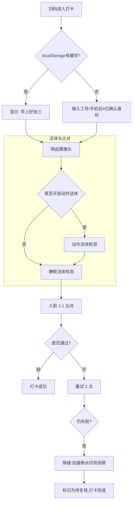

# 考勤打卡微应用系统设计方案 (Time & Attendance Micro-App)

## 1. 业务背景与核心诉求

### 1.1 客户诉求
- **目标群体**：小微企业（约 100 名员工）。
- **核心痛点**：需要一个轻量级的考勤工具，记录员工上下班信息，方便 HR/老板查看考勤状态。
- **实施顾虑**：客户对我方（SaaS 服务商）的实例稳定性和隐私合规存在一定顾虑，希望系统足够轻量、容错率高。

### 1.2 我方（服务商）诉求
- **原始产品目标**：项目最初是面向企业售卖 OCR、人脸、活体等算法能力的 SaaS / API 平台。
- **Playground 角色**：前端 Playground 与 H5 Demo 既用于售前试用和演示，也用于验证这些接口在真实客户集成前的可用性。
- **考勤试点来源**：在产品原型尚不完善、暂不适合大规模推广时，出现了一个约 100 名员工的客户，希望使用轻量级打卡管理。团队因此将考勤作为低风险试点承接，用于验证业务闭环、暴露真实 Bug，并反哺底层 OCR / 活体 / 人脸比对算法优化。
- **核心目标**：构建“数据飞轮”。通过免费提供考勤工具，持续收集真实的、带 Ground Truth（用户人工修正过）的人脸和证件数据。
- **商业目标**：利用这些高质量的脱敏数据，反哺并优化我们底层的活体检测、人脸比对和 OCR 算法模型。
- **架构要求**：作为现有 SaaS 控制台的一个“第一方应用”接入，复用现有的多租户（Organization）和计费统计架构，避免重复造轮子。

---

## 2. 核心架构设计理念

### 2.1 租户完全隔离 (Multi-Tenancy) & Magic Link
- 员工（Employee）不属于系统全局用户（User），而是从属于特定的租户（Organization）。
- 员工不需要注册 SaaS 账号，不需要密码登录。打卡入口为一个带有 `org_id` 签名的专属 H5 链接/二维码（Magic Link）。
- **防错与关联**：员工扫码时，URL 中的 Token 强制绑定当前组织。如果员工进错组织，通过唯一索引 `(org_id, id_number)` 隔离，员工可直接扫描正确公司的二维码重新注册，原公司的异常记录由 HR 随时拉黑删除。

### 2.2 降级优于阻断 (Degradation over Blocking)
考勤是高频且时间敏感的业务（早高峰）。
- **识别降级**：当 1:N 人脸检索失败，或活体检测超时时，不应阻断打卡。应允许员工拍摄带有时间水印的现场照片“异常打卡”，交由 HR 后台人工复核。
- **定位降级**：放弃强制 GPS 定位防作弊（避免合规风险和技术漂移）。依靠“活体+人脸”作为核心信任锚点。

### 2.3 “Human-in-the-loop” 数据采集
- OCR 识别结果仅作为表单的“初始填充值”。
- 系统必须记录 OCR 的**原始输出**与员工**最终提交的修改值**，这两者的 Diff 是算法团队最需要的 Hard Case 数据。

### 2.4 员工信息主权与隐私查看
虽然员工是匿名的（无 SaaS 账号），但必须提供一个机制让员工查看自己的注册信息和打卡记录。
- **方案**：在打卡成功后的结果页，提供一个「我的考勤」入口。
- **机制**：员工在前端输入手机号获取 OTP 验证码，验证通过后，前端获得一个临时的 `Employee-Session-Token`，允许其查询属于自己的 `org_employees` 信息和 `attendance_punch_events`。

### 2.5 当前实现定位
- **当前代码定位**：考勤并不是独立服务，而是后端内的 attendance BFF 模块，挂载在 `/api/v1/attendance/*` 与 `/api/v1/console/attendance/*`。
- **当前成熟度**：员工注册、打卡、Magic Link、管理台基础看板已经落地；员工自助查询入口已临时关闭。动作活体入口已收口到 Attendance BFF，管理端已显式接入 Console 认证与组织上下文链路。人工复核基础流程与状态快照基础更新已接通，且 snapshot 已开始按 employee/group 级 assignment 回填排班上下文与基础迟到/早退分钟数。P1 第一批领域模型（group/site/shift/assignment/review/status snapshot）已进入数据库 schema 基础层。
- **文档说明原则**：本文件描述“设计目标 + 当前实现背景”。凡与代码现状不完全一致的目标态能力，需以 `attendance_app_spec.md` 的“当前实现”说明为准。
- **P00 基线文档**：在继续推进 Attendance 域边界收口前，优先参考 [attendance_p00_blueprint.md](file:///Users/bytedance/Documents/project/go/v/v-backend/docs/specs/attendance_p00_blueprint.md)。

### 2.6 独立性原则
- **业务域独立**：Attendance 应被视为独立业务域，而不是 KYC 能力层的一组页面或临时壳层。
- **部署暂不独立**：在现阶段，Attendance 可继续保留在 `v-backend` 单体中，复用 Organization、Console 用户体系、Auth、Storage、Redis、Monitoring 等公共底座。
- **能力复用而非能力污染**：OCR、Face、Liveness、Storage 属于平台能力；Attendance 通过应用层编排复用这些能力，不应将排班、迟到、门店、实时状态等业务语义下沉到能力层。
- **边界优先于功能堆叠**：在引入用户组、排班、地址、实时报表等需求前，应先完成身份语义、管理端权限边界、数据模型和状态模型的收口。

### 2.7 数据库独立原则
- **当前推荐**：优先采用“单 DB 实例 + 业务域分表/分前缀”的方式推进，即 Attendance 使用自己的业务表，但与平台共享核心公共表。
- **Attendance 自有表**：员工、门店/用户组、班次、排班、打卡事件、状态快照、报表读模型等归 Attendance 域拥有。
- **共享公共表**：Organization、Console 用户、角色权限、OAuth/STS、基础审计与全局用量等仍由平台核心维护。
- **不要复制公共表**：Attendance 不应复制 Organization/User/Permission 的数据结构到自己域内，只应通过 ID、上下文或受控接口引用。
- **何时再拆独立 DB**：当 Attendance 的查询负载、合规要求、独立 SLA、备份恢复或发布节奏明显不同于核心平台时，再考虑物理独立数据库。
- **拆分后的共享方式**：即便未来独立 DB，公共能力仍通过共享身份体系、组织上下文、事件同步或只读投影协作，而不是双写主数据。

### 2.8 分层原则
- **平台原则**：平台提供 OCR、Face、Liveness、Storage、Auth、Quota、Audit 等通用能力，不直接承接迟到、缺卡、门店、排班、报表等行业业务语义。
- **应用原则**：Attendance 作为业务域独立建模，拥有自己的主数据、状态模型、后台管理口径，并通过调用平台能力完成注册、打卡、复核等业务闭环。
- **公共能力原则**：Organization、Console 用户与权限、Redis/Task、日志/Tracing/Metrics、配置中心等属于共享基础设施，由平台统一提供，Attendance 只复用、不复制、不分叉。
- **演进原则**：先完成代码边界独立，再完成数据模型独立，最后视流量、SLA、合规与运维需求决定是否拆部署或拆独立数据库。

### 2.9 开发前范围确认
- 在实现任何新需求前，先判断它属于哪一层：
  - **共享基础设施层**：租户、用户、权限、任务、日志、配置等横向底座
  - **能力集群层**：OCR、Face、Liveness、Storage、Quota 等可复用能力
  - **Attendance 应用层**：员工、门店、用户组、班次、排班、打卡、状态、报表、复核等业务语义
- 若需求引入新的业务术语、状态流转、后台管理语义或报表口径，应优先视为 Attendance 应用层需求。
- 若实现方案会把业务术语直接写入 KYC 能力层或共享基础设施层，应先回到设计阶段重划边界，再开始开发。

---

## 3. 业务流程设计

### 3.1 员工入职注册流程


### 3.2 半匿名打卡流程与设备信任 (Device Trust & 1:1 Fallback)
为了在保障极速体验的同时避免纯 1:N 检索带来的性能消耗和错识率，系统采用“设备信任”机制，将打卡从 1:N 降级为精准的 1:1。
- **首次打卡**：扫码后，页面提示“请输入手机号后4位或姓名首字母”。员工输入后，系统在当前 Org 下模糊匹配出该员工，确认后进入刷脸（此时是 `1:1` 比对）。
- **设备信任缓存**：打卡成功后，前端 H5 将该员工的 `id_number`（或脱敏 Token）加密缓存在手机浏览器的 `localStorage` 中。
- **极速后续打卡**：第二天员工再次扫码时，页面直接读取缓存并显示：“早上好，张三！[点击刷脸打卡]”。员工点一下直接发起 1:1 刷脸。
- **身份切换**：提供明显的“我不是张三，切换身份”按钮，清除缓存并退回首次打卡流程。



### 3.3 反复打卡与去重机制 (Punch-in Deduplication)
员工可能因为不确定是否打卡成功而反复扫码打卡。系统需要处理这种高频操作以防止数据污染和计算资源浪费：
1. **短时防抖 (Rate Limiting/Debouncing)**：在 BFF 层拦截，如果同一个 `employee_id` 在 5 分钟内再次提交打卡请求，直接返回上一次的成功状态，**不调用底层活体和比对模型，也不新增记录**。
2. **读时去重 (Append-Only & Deduplicate on Read)**：在 `attendance_punch_events` 数据库层面，超过 5 分钟的反复打卡会作为**多条独立事件**真实落库（保留数据轨迹）。但在 HR 的考勤报表视图（Dashboard）查询时，按考勤时段通过 SQL 聚合函数（如 `MIN(punch_time)` 或 `MAX(punch_time)`）进行逻辑去重，只展示最有效的一条。

---

## 4. 数据库与存储设计

为了与现有系统解耦，新增以下三张核心业务表：

### 4.1 组织员工表 (`org_employees`)
员工的生命周期与 SaaS 租户强绑定。
```sql
CREATE TABLE org_employees (
    id VARCHAR(64) PRIMARY KEY,
    org_id VARCHAR(64) NOT NULL,          -- 关联 Organization
    employee_sn VARCHAR(64),              -- 客户内部工号
    id_number VARCHAR(64) NOT NULL,       -- 核心锚点 (证件号)
    name VARCHAR(64) NOT NULL,
    phone VARCHAR(20),
    face_feature BLOB,                    -- 提取出的人脸特征向量 (用于 1:1 比对)
    face_image_url VARCHAR(255),          -- 原始人脸图 (用于 HR 查看)
    status VARCHAR(20) DEFAULT 'active',  -- active, inactive, deleted
    created_at DATETIME,
    UNIQUE KEY idx_org_id_number (org_id, id_number)
);
```

### 4.2 打卡事件表 (`attendance_punch_events`)
用于 HR 后台展示和统计。
```sql
CREATE TABLE attendance_punch_events (
    id VARCHAR(64) PRIMARY KEY,
    org_id VARCHAR(64) NOT NULL,
    employee_id VARCHAR(64) NOT NULL,
    punch_time DATETIME NOT NULL,
    punch_type VARCHAR(10),               -- 'in' (上班), 'out' (下班)
    liveness_score FLOAT,                 -- 活体分数留存
    face_score FLOAT,                     -- 1:1 比对分数留存
    status VARCHAR(20),                   -- 'success', 'manual_review' (降级需复核)
    fallback_image_url VARCHAR(255),      -- 失败时的降级现场图
    created_at DATETIME,
    INDEX idx_org_time (org_id, punch_time)
);
```

### 4.3 算法数据反哺表 (`data_collection_documents`)
核心资产表，专供算法团队“白嫖”高质量数据。
- **解耦设计**：该表故意不包含 `employee_id`，只关联 `org_id`。这样当员工离职被物理删除时，其贡献的宝贵算法语料不会被级联删除，实现了合规与业务的完美解耦。
- **冗余策略**：员工反复注册上传的证件，将被视为“多模态增量语料”全盘接收（产生多条记录），而不做去重。

```sql
CREATE TABLE data_collection_documents (
    doc_id VARCHAR(64) PRIMARY KEY,
    org_id VARCHAR(64) NOT NULL,
    id_type VARCHAR(20),                  -- 'passport', 'thai_id', 等
    raw_image_url VARCHAR(255),           -- 证件原图 (受访问策略严格保护)
    raw_ocr_result JSONB,                 -- 模型原始输出 (包含各字段置信度)
    final_user_input JSONB,               -- 用户修改后的 Ground Truth
    is_corrected BOOLEAN,                 -- 是否被用户修改过 (算法团队筛选 Hard Cases 的关键标识)
    created_at DATETIME
);
```

---

## 5. 计费与系统兼容性设计

该微应用不会破坏现有的 API Key 和计费逻辑，而是采用 **BFF (Backend for Frontend)** 模式接入：

1. **BFF 路由**：新建 `/api/v1/attendance/*` 路由组。
2. **内部调用**：前端请求该路由时，BFF 层在内部构建 `KYCRequest`，并调用底层的 `service.Liveness()` 和 `service.FaceCompare()`。
3. **无缝计费**：在 BFF 层注入该租户特定的 `Internal_App_Key`。底层服务像对待普通 API 请求一样，正常记录 `UsageLog` 并扣减 Quota。
4. **流控保护**：在 BFF 层实施严格的 IP 和 Org 级别的 Rate Limiting，防止早高峰压垮底层 GPU 推理服务。

---

## 6. 数据分析与管理者视角 (Analytics & Admin View)

为了满足客户“方便查看考勤状态”的核心诉求，系统需为租户管理员（HR/老板）提供管理视图：
1. **打卡限制策略**：允许管理员配置打卡规则（如：是否允许迟到打卡？是否开启距离提醒？）。
2. **打卡模式动态调整**：允许管理员在 Console 动态调整前端的打卡要求。例如，初期员工抵触人脸识别，可配置为“仅拍照打卡”（跳过活体，状态直接置为 `manual_review`）。后续可无缝切换为“静默活体”或“动作活体”。前端 H5 通过 `/api/v1/attendance/punch/config` 接口获取该配置并动态渲染。
3. **异常处理中心**：管理员可在此处理 `status = manual_review`（因识别失败而降级提交的照片）的记录，进行人工通过或驳回。
4. **考勤报表**：提供周报/月报的聚合视图，通过 `punch_type` (in/out) 自动计算工时，满足最基本的薪资核算需求。

---

## 7. 合规与安全 (Compliance & Security)

1. **隐私政策挂载**：在员工首次扫码注册时，必须勾选包含数据脱敏与算法优化条款的《员工隐私授权协议》。
2. **数据脱敏与存储策略 (Storage Policy)**：
   - 为敏感生物数据（`face_image_url`, `fallback_image_url`, `raw_image_url`）开辟独立的云存储 Bucket。
   - 必须配置严格的生命周期管理（例如：算法提取特征后 30 天自动硬删除），以应对 PDPA/GDPR 审计。
3. **离职清理**：当 HR 在控制台将员工标记为 `deleted` 时，必须同步清理其 `face_feature`，满足被遗忘权。

---

## 8. 当前实现差异说明

- **员工端路由边界**：动作活体入口已收口到 `/api/v1/attendance/punch/liveness/*`，Attendance Magic Link 不再需要直接访问平台 KYC 动作活体路由。
- **管理端安全边界**：`/api/v1/console/attendance/*` 已显式挂入 Console JWT、组织上下文与 Attendance 专项权限链路。
- **自助查询闭环**：设计目标包含 OTP 或其他挑战机制换取临时员工会话；当前 `POST /attendance/self/otp` 与 `GET /attendance/self/records` 已主动关闭，待 employee session auth 设计完成后再恢复。
- **异常复核闭环**：基础的 HR 审批 / 驳回流程已接通，并会同步更新 punch event 与 status snapshot；但更完整的审核台、专属权限点与批量处理能力仍待后续增强。
- **文档使用方式**：后续若继续沿打卡方向演进，应先维护客观事实，再以独立 Roadmap 描述目标架构，避免把“目标态”误写成“已实现”。

---

## 9. P00 / P0 / P1 演进草案

### 9.1 P00：先定边界与主模型
- **目标**：在继续扩展打卡业务前，先把 Attendance 定义为独立业务域，而不是 KYC 能力壳层。
- **必须明确的结果**：
  - 有清楚的应用边界
  - 不直接污染能力层
  - 有自己的主数据
  - 有自己的状态模型
  - 有自己的后台管理口径
  - 明确与平台能力的接口边界
- **主数据建议**：
  - `employee_id`：系统内部主键
  - `employee_no`：组织内稳定业务工号
  - `id_number`：实名证件号锚点
  - `group / site / shift_template / shift_assignment / punch_event / status_snapshot`
- **关键边界**：
  - 平台能力层负责 OCR / Face / Liveness / Storage / Auth / Quota / Audit
  - Attendance 负责员工、排班、地点、状态、报表、复核

### 9.2 P0：先止血的现实收口项
- **已处理**
  - `employee_no` 与 `id_number` 的接口语义开始显式收口，打卡接口支持显式 `employee_no`
  - 员工弱自助查询入口已关闭，待 employee session auth 完成后恢复
  - 前端配置路由已对齐 `/attendance/punch/config`
  - 动作活体流程已通过 Attendance BFF 承接，不再要求员工前端直接访问 `/api/v1/kyc/liveness/action/*`
  - 管理端已显式接入 Console JWT / RequireOrganizationHeader / InjectOrgContext 基础链路
  - 前端设备信任缓存已迁移为 `employee_no` 优先，新的持久化流程不再默认缓存 `id_number`
- **仍未完成**
  - `employee_sn` 仍存在于模型中，但应进入废弃状态，不再作为后续设计依赖
- **P0 剩余清单**
  - 在代码和迁移计划中继续推进 `employee_sn` 到可选 external code 的演进

### 9.3 P1：完整打卡管理系统的建设顺序
- **第一批（后端已基本完成）**
  - 组织级 policy、group membership、review list、snapshot list、employee timeline 等运营接口
  - 用户组 / 门店模型
  - 考勤地址 / 站点模型
  - 班次模板
  - 员工与组、站点、班次的关联关系
  - 基础主数据管理接口（group/site/shift template/assignment）
  - assignment 驱动的 snapshot 基础计算
- **第二批**
  - 排班实例
  - 实时状态快照
  - 迟到 / 缺卡 / 异地 / 待复核状态口径
- **第三批**
  - 后台报表与导出
  - 员工时间线
  - 日报 / 月报读模型
- **当前后端已完成**
  - Attendance 专项权限
  - 主数据 CRUD
  - review / snapshot / timeline 运营接口
  - assignment 驱动 snapshot 基础计算
  - daily / monthly report 与 daily CSV export
- **延后项**
  - 补卡审批流
  - 复杂薪资结算联动
  - 多地区 / 多时区 / 多规则高级策略
